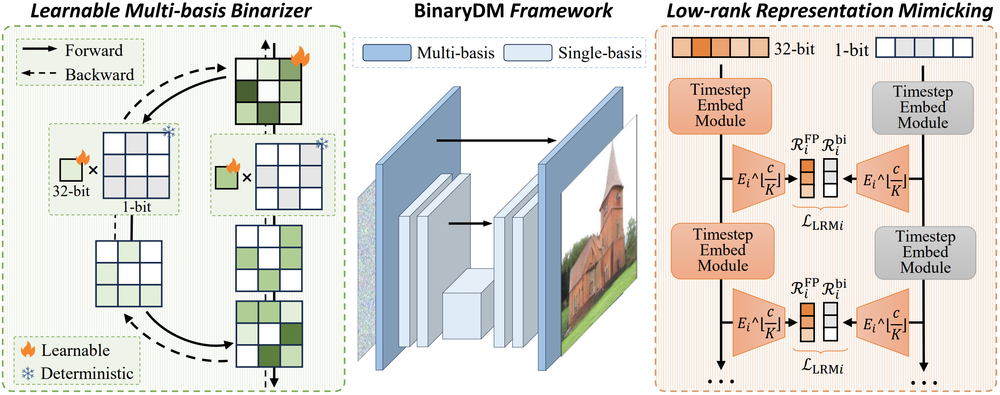
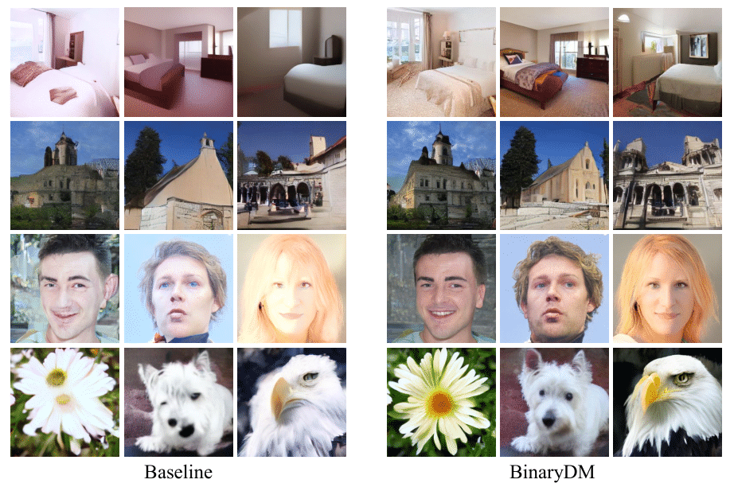

# BinaryDM: Towards Accurate Binarization of Diffusion Model

This implementation supports the paper "BinaryDM: Towards Accurate Binarization of Diffusion Model". [[PDF](https://arxiv.org/abs/2404.05662)]



### Requirements

Establish a virtual environment and install dependencies as referred to [latent-diffusion](https://github.com/CompVis/latent-diffusion).

### Usage

- Replace the existing `main.py` in the LDM with our version of `main.py`.
- Place `openaimodel_ours.py` and `ours_util.py` in the directory `./ldm/modules/diffusionmodules`.
- Place `ddpm_ours.py` in the directory  `./ldm/models/diffusion`
- run `bash train.sh`

#### Visualization Results

- Samples generated by the binarized DM baseline and BinaryDM under W1A4 bit-width.



## Comments

- Our codebase builds on [latent-diffusion](https://github.com/CompVis/latent-diffusion) and [stable-diffusion](https://github.com/CompVis/stable-diffusion). Thanks for open-sourcing!

## BibTeX

If you find *BinaryDM* is useful and helpful to your work, please kindly cite this paper:

```
@misc{zheng2024binarydm,
      title={BinaryDM: Towards Accurate Binarization of Diffusion Model}, 
      author={Xingyu Zheng and Haotong Qin and Xudong Ma and Mingyuan Zhang and Haojie Hao and Jiakai Wang and Zixiang Zhao and Jinyang Guo and Xianglong Liu},
      year={2024},
      eprint={2404.05662},
      archivePrefix={arXiv},
      primaryClass={cs.CV}
}
```

