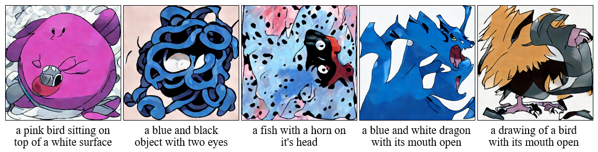
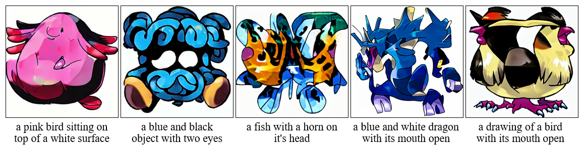
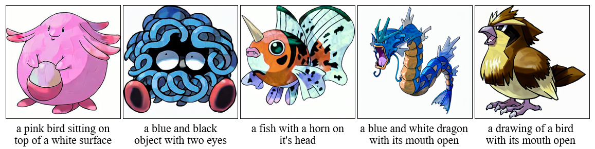
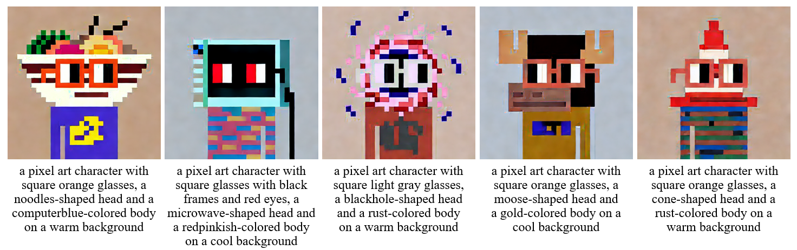
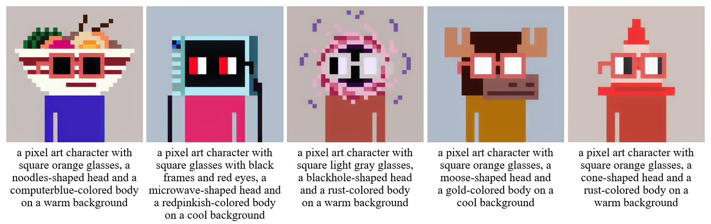
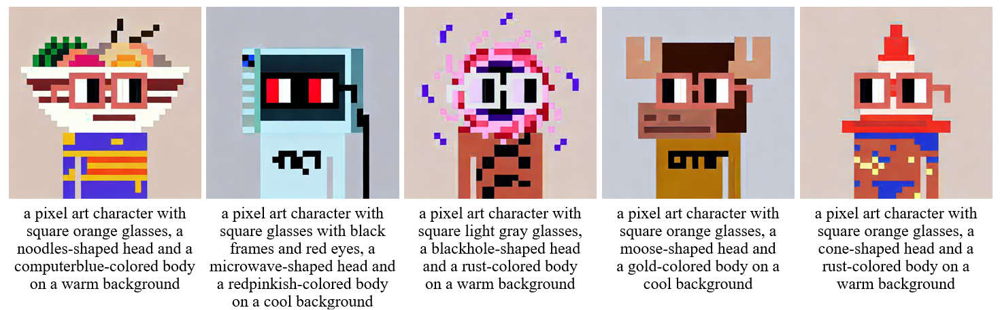

# BinaryDM - txt2img

This implementation supports the paper "BinaryDM: Towards Accurate Binarization of Diffusion Model" on stable diffusion models.

### Requirements

Establish a virtual environment and install dependencies as referred to the [justinpinkney/stable-diffusion](https://github.com/justinpinkney/stable-diffusion).

### Usage

##### lambdalabs/pokemon-blip-captions [download](https://huggingface.co/datasets/lambdalabs/pokemon-blip-captions)

Train:

- Clone the [justinpinkney/stable-diffusion](https://github.com/justinpinkney/stable-diffusion), and download the pre-trained model on huggingface [justinpinkney/pokemon-stable-diffusion](https://huggingface.co/justinpinkney/pokemon-stable-diffusion)
- Replace the existing `main.py` in the [justinpinkney/stable-diffusion](https://github.com/justinpinkney/stable-diffusion) with our version of `main.py`.
- Place `openaimodel_binarydm.py` and `util_binarydm.py` in the directory `./ldm/modules/diffusionmodules`.
- Place `ddpm_binarydm.py` in the directory  `./ldm/models/diffusion`
- run `bash train.sh`

Test:

- Use the `txt2img.py` provided by us, in the same way as the [LambdaLabsML/examples](https://github.com/LambdaLabsML/examples/tree/main/stable-diffusion-finetuning)

##### m1guelpf/nouns [download](https://huggingface.co/datasets/m1guelpf/nouns)

- Since there is no publicly available pre-trained model, so train a full-precision model first
- The remaining steps are consistent with [lambdalabs/pokemon-blip-captions](https://huggingface.co/datasets/lambdalabs/pokemon-blip-captions)

### Visualization Results

##### lambdalabs/pokemon-blip-captions

- baseline-1bit

  

- LSQ-2bit

  

- BinaryDM-1bit

  

##### m1guelpf/nouns

- baseline-1bit

  

- LSQ-2bit

  

- BinaryDM-1bit

  

## Comments

- Our codebase builds on [justinpinkney/stable-diffusion](https://github.com/justinpinkney/stable-diffusion) and [LambdaLabsML/examples](https://github.com/LambdaLabsML/examples/tree/main/stable-diffusion-finetuning). Thanks for open-sourcing!